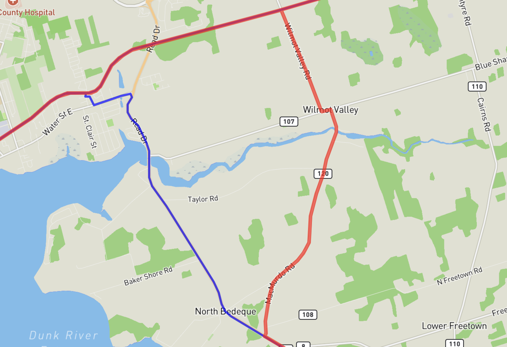
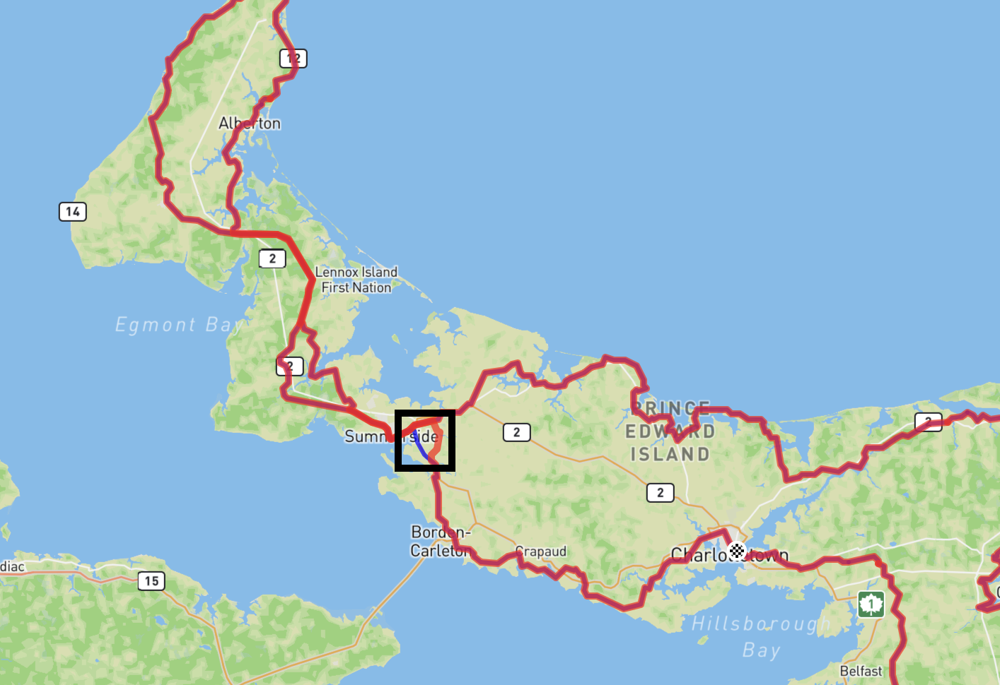

# theislandwalk

Maps and other resources for The Island Walk, Prince Edward Island.

The Island Walk is a 700 km walking trail that loops around PEI. It takes approximately 32 days to complete if you walk 20-25 kilometres per day. However, not all walkers have to plan to walk 20-25 kms per day. There are many opportunities to complete the Island Walk in sections and spend more time exploring certain areas that appeal to you.

This repository contains GIS data, maps, and other resources related to the walk; for more general information, consult [The Island Walk website](https://theislandwalk.ca).

## Route Maps

* [GPX](https://raw.githubusercontent.com/islandtrails/theislandwalk/main/routemap/gpx/theislandwalk.gpx)
* [GeoJSON](https://raw.githubusercontent.com/islandtrails/theislandwalk/main/routemap/geojson/theislandwalk.geojson) ([preview](https://github.com/islandtrails/theislandwalk/blob/main/routemap/geojson/theislandwalk.geojson))
* [theislandwalk.info](https://theislandwalk.info) -- a simple web application showing the route map and 32 days of waypoints

## Changelog

### 2024-03-20

The route of The Island Walk to the east of Summerside has been altered between Bedeque and Summerside: at the intersection of Route 1A and the MacMurdo Road, the route previously continued along Route 1A to Read's Corner; the route now turns right onto MacMurdo Road to the Blue Shank Road, takes a short jog left and then right onto the Wilmot Valley Road, where it joins the trail route coming from Summerside.

In the images below, the previous route is shown in blue and the update route is showing in red.

#### Detailed Map of Changes

#### Overview Map of Changes

